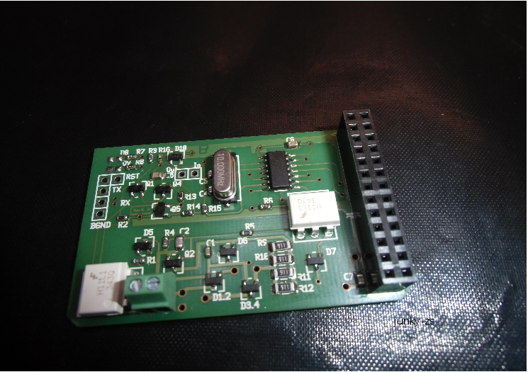
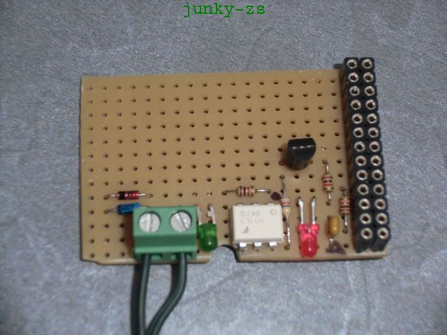
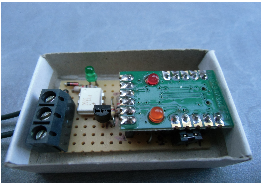

# hometop_HT3

Most everything needed for your heater-system to be shown at your 'hometop' -> 
*pimp your heater*.

**Table of Contents**

- [Introduction](#intro)
- [Used Hardware](#hardware)
- [Software](#software)
- [Changelog](./Changelog.md)
- [Documentation](#docu)
- [Importent notes](#notes)

## Introduction

This project is limited to recording/controlling and presentation of heating and solar informations.
Currently only heater-systems from german manufacturer: **`Junkers`** and system-bus: **`Heatronic/EMS2 (c)`** are supported. 

This repo can not fulfill all wishes you could have to your 'hometop'.
Each has his ideas such as the 'home' can be 'Top'. 
The presentation of informations from the own 'home' with it's heater-system is what this repo will do.
Other projects are working too on this item, example: [FHEM](http://fhem.de/fhem.html)

## Used Hardware

This repo was started creating some different boards for the RaspberryPi(c).  
For the hardware see project: [ht_transceiver](https://github.com/norberts1/hometop_ht_transceiver)

The table shows the currently available boards: 
  

<table>
<tr>
    <th>Board-name </th>
    <th>function</th>
    <th>Comment</th>
</tr>
<tr>
    <td>ht_pitiny</td>
    <td>transmit- and receiving Bus - data</td>
    <td>active ht_transceiver-board for RPi</td>
</tr>
<tr>
    <td>ht_piduino</td>
    <td>transmit- and receiving Bus - data</td>
    <td>active ht_transceiver-board for RPi</td>
</tr>
<tr>
    <td>HT3_Mini_Adapter</td>
    <td>receiving Bus - data</td>
    <td>passive ht_receiver-board for RPi</td>
</tr>
<tr>
    <td>HT3_Micro_Adapter</td>
    <td>receiving Bus - data</td>
    <td>passive ht_receiver-board for USB-interface</td>
</tr>
<tr>
    <td>ht_motherboard</td>
    <td>passiv place-holder board</td>
    <td>for USB-UART and above boards</td>
</tr>
</table>

- Modul: ht_pitiny (Forum see:[ht_pitiny](https://www.mikrocontroller.net/topic/317004#3925213))

  

- Modul: ht_piduino (Forum see:[ht_piduino](https://www.mikrocontroller.net/topic/317004#3925213))

  

- Modul: HT3_Mini_Adapter (Forum see:[HT3_Mini_Adapter](https://www.mikrocontroller.net/topic/317004#3432732))

  

- Modul: HT3_Micro_Adapter (Forum see:[HT3_Micro_Adapter](https://www.mikrocontroller.net/topic/317004#3548193))

  

- Modul: ht_motherboard (Forum see:[ht_motherboard](https://www.mikrocontroller.net/topic/317004#3936050))

## Software

The **software** is written in **python** and designed for detection, decoding and controlling of HT - busdata with following features: 
 

<table>
<tr>
    <th>Modul-name</th>
    <th>function</th>
    <th>remark</th>
</tr>
<tr>
    <td>create_databases.py</td>
    <td>tool for creating databases: sqlite and rrdtool.</td>
    <td>configureable</td>
</tr>
<tr>
    <td>HT3_Analyser.py</td>
    <td>GUI for system-data and raw-hexdump of decoded ht - busdata.</td>
    <td>configureable, default running as ht_proxy.client</td>
</tr>
<tr>
    <td>HT3_Systemstatus.py</td>
    <td>GUI to show system-data only.</td>
    <td>configureable, default running as ht_proxy.client</td>
</tr>
<tr>
    <td>ht_collgate.py</td>
    <td>Running as daemon without GUI starting interfaces for  - ht_data decoding,  - mqtt-IF,  - SPS-IF.</td>
    <td>configureable, default running as ht_proxy.client and  - sqlite = Off,  - rrdtool = On,  - mqtt_IF = Off,  - SPS_IF = Off.</td>
</tr>
<tr>
    <td>ht_proxy.py</td>
    <td>ht-server to collect data from serial port and supporting connected clients with raw - busdata.</td>
    <td>configureable, default accepting any client</td>
</tr>
<tr>
    <td>ht_netclient.py</td>
    <td>ht-client sending commands to the heater-bus.</td>
    <td>manual data-input, configureable, default connecting to 'localhost'</td>
</tr>
<tr>
    <td>ht_binlogclient.py</td>
    <td>acts as logger for binary ht - busdata.</td>
    <td>logfile-name selectable, default connecting to 'localhost'</td>
</tr>
<tr>
    <td>ht_client_example.py</td>
    <td>ht-client acts as example for your one ht-client.</td>
    <td>ht_client-example, default connecting to 'localhost'</td>
</tr>
<tr>
    <td>ht_2hassio.py</td>
    <td>Running as daemon for MQTT-message translation from ht- to HomeAssistant-mqtt messages.</td>
    <td>ht_collgate configuration must be set to: mqtt_IF = On</td>
</tr>
</table>

The current software can be found in subfolders: **`~/HT3/sw/...`**  
Any hardware informations are in subfolders: **`~/HT3/hw/...`**

The software is still under development, but any official release should be runable *'out of the box'* under *Linux*.  
For *Windows* some improvements are required and will be done in the future.  

If you have got any problems with hard- or software, let me know.  
Also your support with binary - logfiles is good to have for further development.

Thank's to all supporting me, in the past and future.  
We all want to have the right thing in the right time.

## Documentation

For project - details see the documentation (folder: **`~/HT3/docu`** ), the wiki and the following links:
* RaspberryPi HT-board forum:
[HT-Boards](https://www.mikrocontroller.net/topic/317004#new)
* Software-forum:
[HT-Software](https://www.mikrocontroller.net/topic/324673#new)

## Importent notes

#### Importent notes:
The reproduction and the commissioning of the adaptations is at your own risk and the description and software do not claim to be complete. A change of software modules and hardware descriptions at any time is possible without notice. Warranty, liability and claims by malfunction of heating or adaptation are hereby expressly excluded.

#### Wichtiger Hinweis:
Der Nachbau und die Inbetriebnahme der Adaptionen ist auf eigene Gefahr und die Beschreibung und die Software erheben nicht den Anspruch auf Vollständigkeit.
Eine Änderung an Software-Modulen und Hardware-Beschreibungen ist jederzeit ohne Vorankündigung möglich.
Gewährleistung, Haftung und Ansprüche durch Fehlfunktionen an Heizung oder Adaption sind hiermit ausdrücklich ausgeschlossen.
